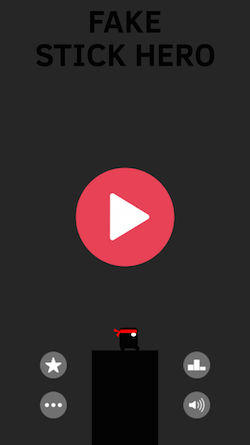

####问题
在实现《Fake Stick Hero》的过程中，需要绘制一些黑色的矩形作为忍者站立的地方。这些柱子都是纯黑色的，并且大小会随机变化，因此选用`SKSpriteNode`或者`SKShapeNode`来实现。可是使用如下代码创建柱子的时候，看不到柱子出现。

```objc
SKSpriteNode *blackNode = [SKSpriteNode spriteNodeWithColor:[SKColor blackColor] size:CGSizeMake(100, 180)];
blackNode.position = CGPointMake(CGRectGetMidX(self.frame), 52);
[self addChild:blackNode];
```

或者在iOS 8中使用如下实现：

```objc
SKShapeNode *blackNode = [SKShapeNode shapeNodeWithRect:CGRectMake(-50, -90, 100, 180)];
blackNode.fillColor = [SKColor blackColor];
blackNode.strokeColor = [SKColor clearColor];
[self addChild:blackNode];
```

这很奇怪，因为其它使用图片创建的精灵都没有问题，效果图如下：


当时就觉得这个忍者很“强大”，凌空飞翔，估计是个FlappyBird类似的游戏。实际上我们需要的效果是脚踏实地的奔跑小忍者。


这非常奇怪，因为所有的精灵都是继承自`SKNode`的`SKSpriteNode`或`SKShapeNode`，但是图片精灵是一层一层往上叠放的。至少慢慢检查：

- 坐标？没问题，旁边的四个按钮也是类似方式设置的。
- 大小？没问题，也设置了，100*180.
- 透明度？没设置，SKSpriteNode默认是不透明的。
- 动画影响？没问题，将所有动画全部停掉，还是不显示。
- 其它精灵？当有背景图片的时候，黑色矩形不显示，但是没有背景图的时候终于看到黑色的柱子了！

```objc
//[self background];	//背景图，注释后就能显示黑色柱子
[self titleLabel];	//标题
[self playButton];	//开始按钮
[self otherButtons];	//其它按钮
[self heroItems];		//忍者和柱子
```



问题是找到了，背景图影响了柱子的显示！可这更奇怪了，柱子是最后添加了，连按钮和忍者都显示了，常理来说，黑色柱子更应该显示才对。由于思维定势，根本就没有往`zPosition`的方向考虑！

搭上梯子后Google了一下，直接在[https://teamtreehouse.com/forum/spritenodewithcolor-not-appearing-in-skscene](https://teamtreehouse.com/forum/spritenodewithcolor-not-appearing-in-skscene)上找到了答案：**Lee Hardy**给出来了——***zPosition*** !!! 

```objc
GroundNode *ground = [GroundNode groundWithSize:CGSizeMake(self.frame.size.width, 22)];
ground.zPosition = +1;
[self addChild:ground];
```

这能算是`SpriteKit`的bug吗？`SKShapeNode`和`[SKSpriteNode spriteNodeWithColor:[SKColor blackColor] size:CGSizeMake(100, 180)]`默认会出现在所有相同`zPosition`的节点后面，而与它们被添加的先后顺序无关！！！！ 泪奔～ 最后代码如下：

```objc
SKSpriteNode *blackNode = [SKSpriteNode spriteNodeWithColor:[SKColor blackColor] size:CGSizeMake(100, 180)];
blackNode.position = CGPointMake(CGRectGetMidX(self.frame), 52);
blackNode.zPosition = 1;
[self addChild:blackNode];
```

当然，如果你只需要支持iOS 8，可以使用`SKShapeNode`。

好吧，就到这里了，接下来请关注**长沙戴维营教育**的《Fake Stick Hero》开发视频教程Objective-C版。当然，Swift版也会很快出来。

> 本文档由**[长沙戴维营教育](http://www.diveinedu.cn)**整理。

