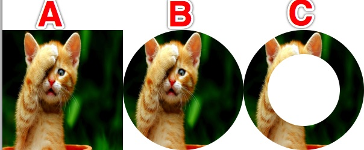
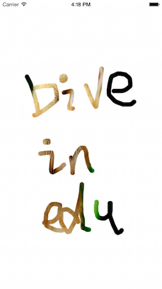

裁剪（clip）可以将绘制内容限制在一某个区域中，比如将一个图片显示在一个圆或者环上。


上图中，A是没有经过任何处理的图片，直接绘制在视图上。

```objc
//读取资源文件夹下的图片"miao.jpg"
UIImage *image = [UIImage imageNamed:@"miao.jpg"];
//绘制在大小为(100, 100)的矩形区域，图片有压缩现象
[image drawInRect:CGRectMake(0, 100, 100, 100)];
```

B是使用简单的圆形路径进行裁剪。

```objc
//保存当前图形上下文的状态，以免影响其它地方的绘制
CGContextSaveGState(cxt);
//创建直径为100的圆形路径
CGPathRef path = CGPathCreateWithEllipseInRect(CGRectMake(100, 100, 100, 100), NULL);
CGContextAddPath(cxt, path);
//设置裁剪
CGContextClip(cxt);
//绘制图形，只显示裁剪区域中的部分
[image drawInRect:CGRectMake(100, 100, 100, 100)];
//恢复图形上下文状态
CGContextRestoreGState(cxt);
```

C是使用Bezier曲线进行裁剪。

```objc
CGContextSaveGState(cxt);
//创建Bezier曲线表示的直径大的圆
UIBezierPath *bPath = [UIBezierPath bezierPathWithOvalInRect:CGRectMake(200, 100, 100, 100)];
//设置填充规则为奇偶填充
bPath.usesEvenOddFillRule = YES;
//给路径创建直径小的圆
UIBezierPath *bsPath = [UIBezierPath bezierPathWithOvalInRect:CGRectMake(220, 120, 60, 60)];
//将小圆添加到大圆路径上
[bPath appendPath:bsPath];
//裁剪，两个路径形成一个环
[bPath addClip];
//绘制图像，填充奇偶规则表示的内部，即环状
[image drawInRect:CGRectMake(200, 100, 100, 100)];
CGContextRestoreGState(cxt);
```

通过裁剪，可以实现类似相框、拼图的功能，甚至实现擦除（刮奖）效果。但是裁剪的结果现的比较生硬，并且复杂路径的绘制不是很方便。因此我们继续考察别的技术——蒙版（Mask）。蒙版是将一个没有透明度的灰度图片覆盖在已有的图像上，然后根据颜色值决定图像的显示效果。白色表示全部透过，黑色表示完全不透过，其它是半透明的。而设计师可以用许多工具制作一些精美的蒙版。



```objc
//绘制蒙版图像
- (UIImage *)grayImageWithPoints {
    CGFloat width = self.bounds.size.width;
    CGFloat height = self.bounds.size.height;
    //灰度色彩空间
    CGColorSpaceRef colorSpace = CGColorSpaceCreateDeviceGray();
    //没有alpha通道的bitmap图像
    CGContextRef context = CGBitmapContextCreate(NULL, width, height, 8, width, colorSpace, (CGBitmapInfo)kCGImageAlphaNone);
    
    if (context == NULL) {
        return nil;
    }
    
    //填充黑色
    CGContextSetFillColorWithColor(context, [UIColor blackColor].CGColor);
    CGContextFillRect(context, CGRectMake(0, 0, width, height));
    
    CGContextSaveGState(context);
    
//    CGContextSetBlendMode(context, kCGBlendModeLighten);
//设置画线的属性
    CGContextSetLineWidth(context, 10);
    CGContextSetStrokeColorWithColor(context, [UIColor colorWithWhite:1 alpha:1.0].CGColor);
    CGContextSetLineJoin(context, kCGLineJoinRound);
    CGContextSetLineCap(context, kCGLineCapRound);
    CGContextAddPath(context, _path);
    //画线
    CGContextStrokePath(context);
    
    CGContextRestoreGState(context);
    
    //创建图像
    CGImageRef imageRef = CGBitmapContextCreateImage(context);
    CGContextRelease(context);

    UIImage *image = [UIImage imageWithCGImage:imageRef];
    CGImageRelease(imageRef);
    
    return image;
}
```

使用蒙版进行绘制。

```objc
- (void)drawRect:(CGRect)rect {
    CGContextRef cxt = UIGraphicsGetCurrentContext();
    
    CGContextSaveGState(cxt);
    //获取蒙版
    UIImage *mask = [self grayImageWithPoints];
    if (mask == nil) {
        CGContextRestoreGState(cxt);
        return;
    }
    //使用蒙版进行裁剪
    CGContextClipToMask(cxt, rect, mask.CGImage);
    //绘制图像
    UIImage *image = [UIImage imageNamed:@"miao.jpg"];
    [image drawInRect:rect];
    
    CGContextRestoreGState(cxt);
}
```

> 本文档由**[长沙戴维营教育](http://www.diveinedu.cn)**整理。
