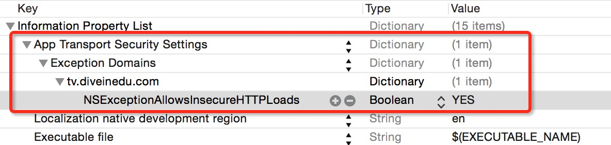
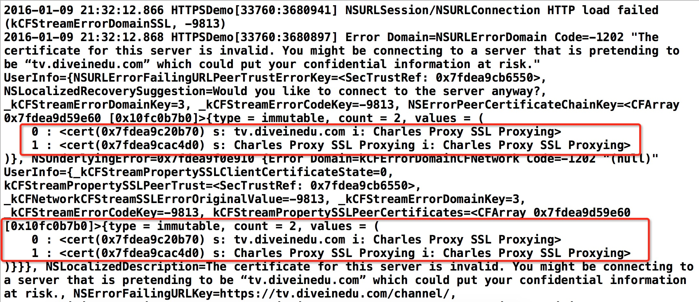
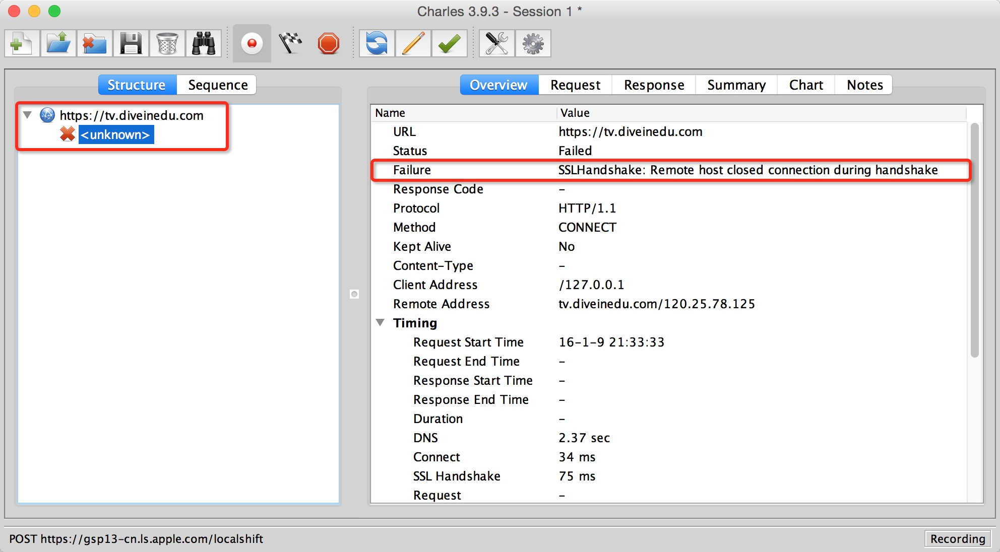

#iOS应用网络安全之HTTPS

##1.  HTTPS/SSL的基本原理

 安全套接字层 (Secure Socket Layer, SSL) 是用来实现互联网安全通信的最普遍的标准。Web 应用程序使用 HTTPS（基于 SSL 的 HTTP），HTTPS 使用数字证书来确保在服务器和客户端之间进行安全、加密的通信。在 SSL 连接中，客户机和服务器在发送数据之前都要对数据进行加密，然后由接受方对其进行解密。

 当浏览器（客户端）需要与某个安全站点建立连接时，先建立TCP连接（三次握手），然后再发生 SSL会话握手：
 - 浏览器将通过网络发送请求安全会话的消息（通常请求以 https 而非 http 开头的 URL）。
 - 服务器通过发送其证书（包括公钥）进行响应。
 - 浏览器将检验服务器的证书是否有效，并检验该证书是否是由其证书位于浏览器的数据库中的（并且是可信的）CA 所签发的。它还将检验 CA 证书是否已过期。
 - 如果证书有效，浏览器将生成一个==**一次性的、唯一的**==会话密钥，并使用服务器的公钥对该会话密钥进行加密。然后，浏览器将把加密的会话密钥发送给服务器，这样服务器和浏览器都有一份会话密钥。
 - 服务器可以使用其专用密钥对消息进行解密，然后恢复会话密钥。

握手之后，即表示客户端已验证了 Web 站点的身份，并且只有该客户端和 Web 服务器拥有会话密钥副本。从现在开始，客户机和服务器便可以使用该会话密钥对彼此间的所有通信进行加密。这样就确保了客户机和服务器之间的通信的安全性。

上面是一般也是应用最普遍的单向验证方式，由浏览器（客户端）来验证服务端的合法性；其实也可以做双向验证，服务器也可以验证浏览器（客户端）的合法性，不过一般使用在银行业务上，比如U盾之类。我们现在关注普遍的单向验证方式的应用。


##2. iOS移动开发HTTPS应用现状
 当下绝大部份的移动互联网项目都采用HTTP、HTTPS协议作为前后端的数据接口协议。而iOS开发群体中，绝大部分都在项目中应用了第三方开源的HTTP请求框架AFNetworking来快速而高效的开发，毕竟快鱼吃慢鱼的时代嘛。AFNetworking请求HTTP接口简直是简单得不能再简单了。只不过从iOS9.0开始需要设置Info.plist中App Transport Security打开非HTTP的资源加载，因为Apple默认只允许采用经过权威证书颁发机构签名的证书的HTTPS站点的访问，一切是为了安全。安全。安全。
 那么我们重点来分析采用HTTPS协议的后台接口的一般使用方式：
 HTTPS的服务器配置的证书分两大类，一类是经过权威机构签名颁发的证书，这样证书通常是要花钱买服务的，当然现在也有少数机构提供免费的证书签名服务。另一类就是服务器配置的是研发人员自己签名生成的证书。

 ##3.AFN调用使用权威机构颁发证书的HTTPS接口
 现在AFNetworking框架已经修复了上半年爆出的SSL中间人攻击漏洞，并强烈要求开发者使用公钥绑定或者证书绑定的安全策略，那么正确使用AFNetworking请求这类证书的HTTPS站点代码很简单如下：

```c
	AFSecurityPolicy *policy = [AFSecurityPolicy policyWithPinningMode:AFSSLPinningModePublicKey];
	policy.validatesDomainName = YES;
    AFHTTPSessionManager *manager = [AFHTTPSessionManager manager];
    manager.securityPolicy = policy;
    manager.requestSerializer.cachePolicy = NSURLRequestReloadIgnoringLocalCacheData;

```
对于这类证书的站点，Info.plist都不需要设置，因为已经是权威机构颁发的证书了，我们只需要设置验证绑定方式和验证域名以防止中间人攻击，毕竟申请证书是花了钱(现在也有免费的申请，比如WoSign)，省事一点。


 ##4.AFN调用使用我们自己签名证书的HTTPS接口

 对于使用我们自己签名的证书来说，浏览器打开web站点也会默认阻止访问，除非用户手动把该站点加入信任列表，这个手动加入的过程其实就是不去验证服务器的合法性，任性的认为服务器是可信赖的。
 那么手动加入信任列表，这样会导致证书的验证过程压根没发生，虽然可以成功访问目标服务器返回我们需要的数据，其实，这中间很有可能返回的数据不是正真的目标服务器返回的数据，也可能是网络传输中间的第三者伪装返回的数据。传输的数据被人窃取甚至纂改都是很可能的。
 ###4.1 不正确的做法
 浏览器手动加入自签名站点到信任列表这个操作的功能相当于iOS开发中AFNetworking的API的如下做法：
 - A 非权威机构颁发证书的HTTPS请求一样必须先在Info.plist设置如下：

```xml
    <key>NSAppTransportSecurity</key>
    <dict>
        <key>NSAllowsArbitraryLoads</key>
        <true/>
    </dict>
```
 - B AFNetworking代码设置SecurityPolicy
站点 https://tv.diveinedu.com 是我前面博客所讲的配置方法配置的自签名证书。

```objectivec
    AFHTTPSessionManager *manager = [AFHTTPSessionManager manager];
    //允许非权威机构颁发的证书
    manager.securityPolicy.allowInvalidCertificates = YES;
    //也不验证域名一致性
    manager.securityPolicy.validatesDomainName = NO;
    //关闭缓存避免干扰测试
    manager.requestSerializer.cachePolicy = NSURLRequestReloadIgnoringLocalCacheData;
    [manager GET:@"https://tv.diveinedu.com/channel/" parameters:nil progress:nil success:^(NSURLSessionDataTask * _Nonnull task, id  _Nullable responseObject) {
        NSLog(@"%@",responseObject);
    } failure:^(NSURLSessionDataTask * _Nullable task, NSError * _Nonnull error) {
        NSLog(@"%@",error);
    }];
```

经过如上两步设置之后，我们可以在iOS应用中访问我们采用自签名证书的HTTPS站点了。但是这个是不安全的，因为他在没有使用HTTPS/SSL代理和使用像Charles那样的HTTPS/SSL代理的情况下都可以访问服务器资源. 完全可以说是白费功夫，只能防止“君子”在网络中用Wireshark之类来TCP抓包嗅探。因为毕竟还是HTTPS加密了传输数据了。那为什么我要说这样是白费功夫呢，因为这个办法不能防止中间人攻击！比如用户可以给手机设置HTTPS的SSL代理（比如Charles），完全可以在代理中看到明文数据，所以，既然用了HTTPS就要防止中间人攻击，不然还不如不用HTTPS。

下面我们来看看怎么用Charles代理抓包工具所抓到的HTTPS传输的数据：

上图是在Mac上运行Charles工具代理抓包，真机和Mac电脑同一个局域网，并设置代理为Mac机的IP和Charles的代理端口8888，然后启动App请求网络后抓到的数据。是不是很意外啊。HTTPS的数据也抓出明文了。
显然这样是非常不安全的，那么当我们使用自签名证书的时候，我们该如何来在App端(客户端)严格的验证服务器的合法性呢？

 ###4.2 正确的做法
 我们要在App端严格验证服务器的合法性,防止网络中间的代理或者防火墙进行中间人的攻击和证书欺骗,那么我们需要把服务器配置的证书打包到客户端程序中(私钥留服务器不要分发不用泄露,非常重要),在代码里去读取该证书/公钥信息和服务器返回的进行匹配验证.
 在iOS开发中,从Xcode7和iOS9开始,Apple提升了App的网络安全性,App默认只能进行对采用权威机构签名颁发证书的Web站点进行访问(信任的HTTPS),而自签名的证书的HTTPS站点也被列为属于例外,所以我们需要在App的Info.plist中单独为我们的域名设置`Exception Domains`"白名单",而不是打开`Allow Arbitrary Loads`全部放开,设置信息如下:



 ```xml
    <key>NSAppTransportSecurity</key>
    <dict>
        <key>NSExceptionDomains</key>
        <dict>
            <key>tv.diveinedu.com</key>
            <dict>
                <key>NSExceptionAllowsInsecureHTTPLoads</key>
                <true/>
            </dict>
        </dict>
    </dict>
 ```
 这样就不像上面那个方法那样一刀切全部放开, 而是单独为某个域名放开设置.当然上面也可以使用放开全部的设置`NSAllowsArbitraryLoads`为`true`.但是我建议使用白名单.

 除此之外,要做到严格验证防止像Charles那样的中间人代理抓包,AFNetworking代码应该用如下设置:

 ```objectivec
	//服务器端配置的包含公钥的证书分发到客户端后,需要转换为DER格式的证书文件.
    //openssl x509 -outform der -in tv.diveinedu.com.crt -out tv.diveinedu.com.der
    NSString *certFilePath = [[NSBundle mainBundle] pathForResource:@"tv.diveinedu.com" ofType:@"der"];
    NSData *certData = [NSData dataWithContentsOfFile:certFilePath];
    NSSet *certSet = [NSSet setWithObject:certData];
    AFSecurityPolicy *policy = [AFSecurityPolicy policyWithPinningMode:AFSSLPinningModePublicKey withPinnedCertificates:certSet];
    policy.allowInvalidCertificates = YES;
    AFHTTPSessionManager *manager = [AFHTTPSessionManager manager];
    manager.securityPolicy = policy;
    //关闭缓存避免干扰测试
    manager.requestSerializer.cachePolicy = NSURLRequestReloadIgnoringLocalCacheData;
    [manager GET:@"https://tv.diveinedu.com/channel/" parameters:nil progress:nil success:^(NSURLSessionDataTask * _Nonnull task, id  _Nullable responseObject) {
        NSLog(@"%@",responseObject);
    } failure:^(NSURLSessionDataTask * _Nullable task, NSError * _Nonnull error) {
        NSLog(@"%@",error);
    }];

```
上面的代码能够验证服务器身份在没有使用代理的时候可以正常访问服务器的资源,但是一旦用户给手机网络设置使用了如Charle那样的HTTPS/SSL代理服务,则会出现服务器证书验证失败,SSL网络连接会断开,老板再也不用担心数据接口被人抓包或者代理给扒出来了.故达到防止中间人攻击的效果.

当使用Charles SSL代理时Xcode调试终端出错信息图:


代理服务器Charles那边的出错信息图:



最后,关于iOS9和OSX 10.11 开发时,Xcode的Info.plist的NSAppTransportSecurity详细设置方法请参考Apple官方文档:
[NSAppTransportSecurity Reference](https://developer.apple.com/library/ios/documentation/General/Reference/InfoPlistKeyReference/Articles/CocoaKeys.html#//apple_ref/doc/uid/TP40009251-SW33)
